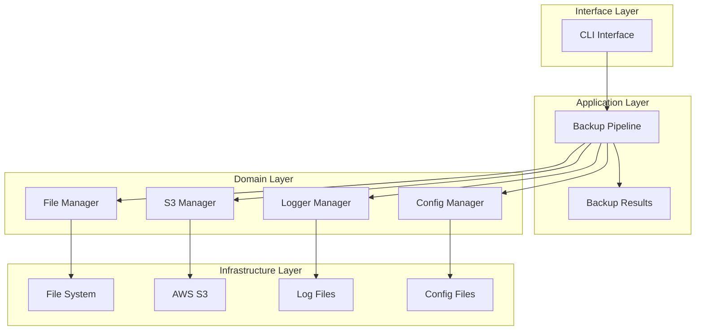
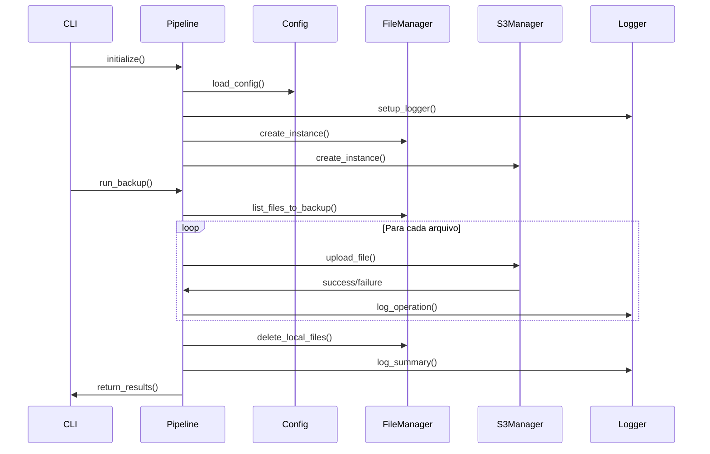
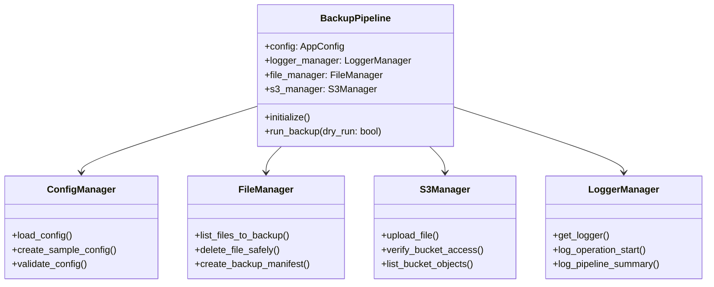

# Visão Geral da Arquitetura

## 🏗️ Arquitetura do Sistema

A pipeline ETL Backup Case foi projetada seguindo princípios de **Clean Architecture** e **SOLID**, garantindo modularidade, testabilidade e manutenibilidade.



## 🔄 Fluxo de Execução



## 🧩 Componentes Principais

### 1. Config Manager
- **Responsabilidade**: Gerenciamento de configuração
- **Tecnologia**: Pydantic para validação
- **Características**:
  - Validação de tipos
  - Override por variáveis de ambiente
  - Configuração hierárquica

### 2. Logger Manager
- **Responsabilidade**: Sistema de logging estruturado
- **Tecnologia**: Python logging com handlers customizados
- **Características**:
  - Múltiplos handlers (console, arquivo)
  - Rotação automática de logs
  - Logs estruturados para métricas

### 3. File Manager
- **Responsabilidade**: Operações de arquivo local
- **Características**:
  - Listagem com filtros
  - Deleção segura
  - Geração de manifestos

### 4. S3 Manager
- **Responsabilidade**: Operações AWS S3
- **Tecnologia**: boto3 SDK
- **Características**:
  - Upload com verificação de integridade
  - Tratamento robusto de erros
  - Retry automático

### 5. Backup Pipeline
- **Responsabilidade**: Orquestração do processo
- **Características**:
  - Coordenação de componentes
  - Controle de fluxo
  - Coleta de métricas

## 🔀 Padrões Arquiteturais

### Dependency Injection
```python
class BackupPipeline:
    def __init__(self, config_path: str):
        self.config = ConfigManager(config_path).load_config()
        self.logger_manager = LoggerManager(self.config.logging)
        self.file_manager = FileManager(self.config.backup, self.logger_manager)
        self.s3_manager = S3Manager(self.config.aws, self.config.s3, self.logger_manager)
```

### Strategy Pattern
```python
# Diferentes estratégias de upload podem ser implementadas
class S3UploadStrategy:
    def upload(self, file_path: str) -> bool: ...

class MultipartUploadStrategy(S3UploadStrategy): ...
class SimpleUploadStrategy(S3UploadStrategy): ...
```

### Observer Pattern
```python
# Logger atua como observer das operações
pipeline.add_observer(logger_manager)
pipeline.notify_operation_complete(operation_result)
```

## 📊 Diagrama de Classes



## 🔒 Princípios de Design

### SOLID Principles

1. **Single Responsibility**: Cada classe tem uma responsabilidade única
2. **Open/Closed**: Extensível sem modificar código existente
3. **Liskov Substitution**: Implementações podem ser substituídas
4. **Interface Segregation**: Interfaces específicas e coesas
5. **Dependency Inversion**: Dependências injetadas, não instanciadas

### Clean Architecture

- **Separação de camadas** bem definida
- **Independência de frameworks** externos
- **Testabilidade** com mocks e stubs
- **Flexibilidade** para mudanças futuras

## 🚀 Benefícios da Arquitetura

### Manutenibilidade
- Código modular e bem organizado
- Responsabilidades claras
- Fácil debugging e troubleshooting

### Escalabilidade
- Componentes independentes
- Possibilidade de processamento paralelo
- Extensão para novos provedores cloud

### Testabilidade
- Injeção de dependências
- Interfaces bem definidas
- Mocking facilitado

### Confiabilidade
- Tratamento robusto de erros
- Validação em múltiplas camadas
- Logging abrangente para auditoria