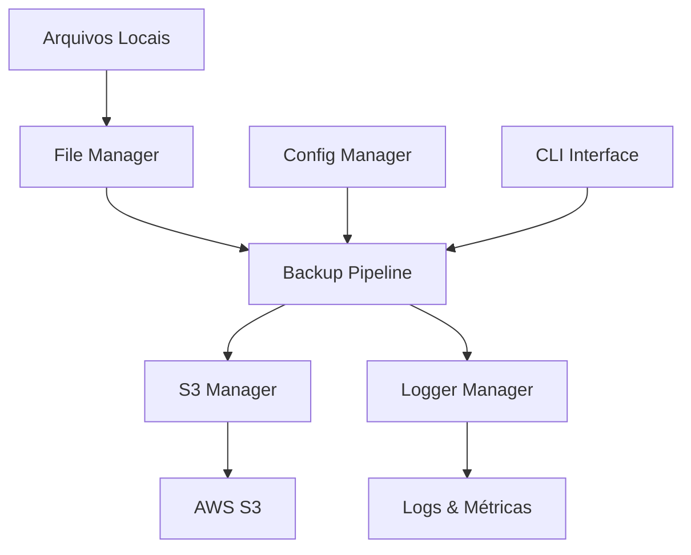

# ETL Backup Case - Pipeline S3

[](https://python.org)
[](https://aws.amazon.com/s3/)
[](https://github.com/vitoriarntrindade/etl-backup-case)

## 🎯 Visão Geral

Pipeline automatizada para backup de arquivos locais para Amazon S3, desenvolvida com Python 3.12+ seguindo as melhores práticas de desenvolvimento.

### ✨ Características Principais

- **🔄 Pipeline Completa**: Lista → Upload → Validação → Deleção Local
- **☁️ Integração AWS S3**: Upload seguro com verificação de integridade
- **📝 Logging Estruturado**: Logs detalhados com rotação automática
- **🔧 Configurável**: Arquivo YAML e variáveis de ambiente
- **🧪 Modo Dry-Run**: Testa sem executar operações reais
- **📊 Métricas Detalhadas**: Relatórios de execução em JSON
- **🛡️ Segurança**: Validações e tratamento robusto de erros

## 🏗️ Arquitetura



## 🚀 Início Rápido

### 1. Instalação

```bash
git clone https://github.com/vitoriarntrindade/etl-backup-case.git
cd etl-backup-case
python -m venv .venv
source .venv/bin/activate  # Linux/Mac
pip install -r requirements.txt
```

### 2. Configuração

```bash
# Criar arquivo de configuração
python pipeline.py --create-config

# Configurar credenciais AWS
cp .env.template .env
# Editar .env com suas credenciais
```

### 3. Execução

```bash
# Teste (dry-run)
python pipeline.py --dry-run

# Backup real
python pipeline.py

# Com saída JSON
python pipeline.py --output-json results.json
```

## 📋 Funcionalidades

### Pipeline de Backup
- ✅ Listagem inteligente de arquivos com filtros
- ✅ Upload paralelo para S3 com retry automático
- ✅ Verificação de integridade pós-upload
- ✅ Deleção segura de arquivos locais
- ✅ Limpeza de diretórios vazios

### Configuração e Segurança
- ✅ Configuração via YAML com validação Pydantic
- ✅ Override por variáveis de ambiente
- ✅ Credenciais AWS seguras (.env)
- ✅ Validação de permissões S3

### Qualidade e Monitoramento
- ✅ Logging estruturado com múltiplos handlers
- ✅ Métricas de execução detalhadas
- ✅ Manifestos de backup com timestamps
- ✅ Relatórios JSON para automação

## 🛠️ Componentes

| Componente | Descrição | Responsabilidade |
|------------|-----------|------------------|
| **ConfigManager** | Gerenciamento de configuração | Validação, carregamento, overrides |
| **LoggerManager** | Sistema de logging | Logs estruturados, rotação, métricas |
| **S3Manager** | Operações AWS S3 | Upload, verificação, gerenciamento |
| **FileManager** | Operações de arquivo | Listagem, filtros, deleção segura |
| **BackupPipeline** | Orquestrador principal | Coordenação do fluxo completo |

## 📊 Exemplo de Saída

```json
{
  "start_time": "2025-11-01T10:30:00",
  "end_time": "2025-11-01T10:32:15",
  "duration_seconds": 135.42,
  "total_files": 25,
  "successful_uploads": 24,
  "failed_uploads": 1,
  "success_rate_percent": 96.0,
  "deleted_files": 24,
  "upload_errors": [
    ["file.corrupted", "Erro de integridade"]
  ]
}
```

## 🔗 Links Úteis

- [📖 Guia de Instalação](installation.md)
- [⚙️ Configuração AWS](configuration/aws.md)
- [🎮 Interface CLI](usage/cli.md)
- [🏗️ Arquitetura Detalhada](architecture/overview.md)
- [� Exemplos Práticos](examples.md)

## 🤝 Contribuição

Contribuições são bem-vindas! Abra issues e pull requests no [repositório GitHub](https://github.com/vitoriarntrindade/etl-backup-case).

## 📄 Licença

Este projeto está sob a licença MIT. Veja o arquivo [LICENSE](https://github.com/vitoriarntrindade/etl-backup-case/blob/main/LICENSE) para detalhes.